# NodePool Conditions Flow Diagram (Code-Annotated)

This document provides comprehensive flow diagrams for all NodePool conditions in HyperShift, with annotations showing the exact code locations where each condition transition occurs.

## Table of Contents

1. [Overall Reconciliation Flow](#overall-reconciliation-flow)
2. [Validation Conditions](#validation-conditions)
3. [Management Conditions](#management-conditions)
4. [Update Status Conditions](#update-status-conditions)
5. [Readiness and Health Conditions](#readiness-and-health-conditions)
6. [Reconciliation and Lifecycle Conditions](#reconciliation-and-lifecycle-conditions)
7. [Platform-Specific Conditions](#platform-specific-conditions)
8. [Complete Condition Reference](#complete-condition-reference)

## Overall Reconciliation Flow

The main reconciliation loop is in `nodepool_controller.go:256-410`.

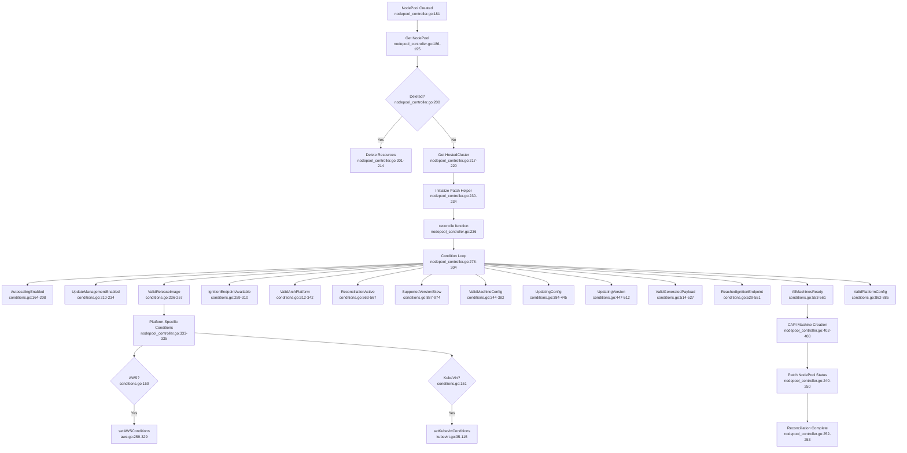
```mermaid
graph TD
    Start[NodePool Created<br/>nodepool_controller.go:181] --> GetNodePool[Get NodePool<br/>nodepool_controller.go:186-195]
    GetNodePool --> CheckDeleted{Deleted?<br/>nodepool_controller.go:200}

    CheckDeleted -->|Yes| Delete[Delete Resources<br/>nodepool_controller.go:201-214]
    CheckDeleted -->|No| GetHostedCluster[Get HostedCluster<br/>nodepool_controller.go:217-220]

    GetHostedCluster --> InitPatch[Initialize Patch Helper<br/>nodepool_controller.go:230-234]
    InitPatch --> Reconcile[reconcile function<br/>nodepool_controller.go:236]

    Reconcile --> ConditionLoop[Condition Loop<br/>nodepool_controller.go:278-304]

    ConditionLoop --> AutoscalingEnabled[AutoscalingEnabled<br/>conditions.go:164-208]
    ConditionLoop --> UpdateManagementEnabled[UpdateManagementEnabled<br/>conditions.go:210-234]
    ConditionLoop --> ValidReleaseImage[ValidReleaseImage<br/>conditions.go:236-257]
    ConditionLoop --> IgnitionEndpointAvailable[IgnitionEndpointAvailable<br/>conditions.go:259-310]
    ConditionLoop --> ValidArchPlatform[ValidArchPlatform<br/>conditions.go:312-342]
    ConditionLoop --> ReconciliationActive[ReconciliationActive<br/>conditions.go:563-567]
    ConditionLoop --> SupportedVersionSkew[SupportedVersionSkew<br/>conditions.go:887-974]
    ConditionLoop --> ValidMachineConfig[ValidMachineConfig<br/>conditions.go:344-382]
    ConditionLoop --> UpdatingConfig[UpdatingConfig<br/>conditions.go:384-445]
    ConditionLoop --> UpdatingVersion[UpdatingVersion<br/>conditions.go:447-512]
    ConditionLoop --> ValidGeneratedPayload[ValidGeneratedPayload<br/>conditions.go:514-527]
    ConditionLoop --> ReachedIgnitionEndpoint[ReachedIgnitionEndpoint<br/>conditions.go:529-551]
    ConditionLoop --> AllMachinesReady[AllMachinesReady<br/>conditions.go:553-561]
    ConditionLoop --> ValidPlatformConfig[ValidPlatformConfig<br/>conditions.go:862-885]

    ValidReleaseImage --> PlatformConditions[Platform-Specific Conditions<br/>nodepool_controller.go:333-335]

    PlatformConditions --> AWSPlatform{AWS?<br/>conditions.go:150}
    PlatformConditions --> KubeVirtPlatform{KubeVirt?<br/>conditions.go:151}

    AWSPlatform -->|Yes| AWSConditions[setAWSConditions<br/>aws.go:259-329]
    KubeVirtPlatform -->|Yes| KubeVirtConditions[setKubevirtConditions<br/>kubevirt.go:35-115]

    AllMachinesReady --> CAPIMachineCreation[CAPI Machine Creation<br/>nodepool_controller.go:402-408]

    CAPIMachineCreation --> Patch[Patch NodePool Status<br/>nodepool_controller.go:240-250]

    Patch --> End[Reconciliation Complete<br/>nodepool_controller.go:252-253]
```

## Validation Conditions

### ValidReleaseImage Condition

**Code Location**: `conditions.go:236-257`

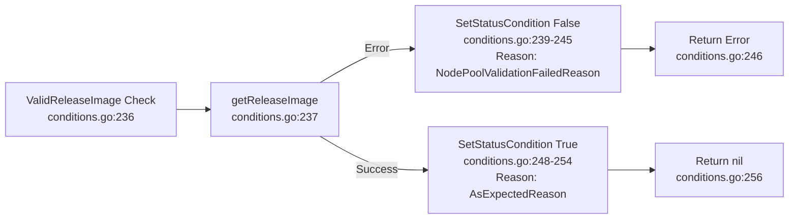
```mermaid
graph LR
    Start[ValidReleaseImage Check<br/>conditions.go:236] --> GetRelease[getReleaseImage<br/>conditions.go:237]

    GetRelease -->|Error| SetFalse[SetStatusCondition False<br/>conditions.go:239-245<br/>Reason: NodePoolValidationFailedReason]
    GetRelease -->|Success| SetTrue[SetStatusCondition True<br/>conditions.go:248-254<br/>Reason: AsExpectedReason]

    SetFalse --> Return[Return Error<br/>conditions.go:246]
    SetTrue --> Return2[Return nil<br/>conditions.go:256]
```

### ValidPlatformImage Condition (AWS)

**Code Location**: `aws.go:259-306`

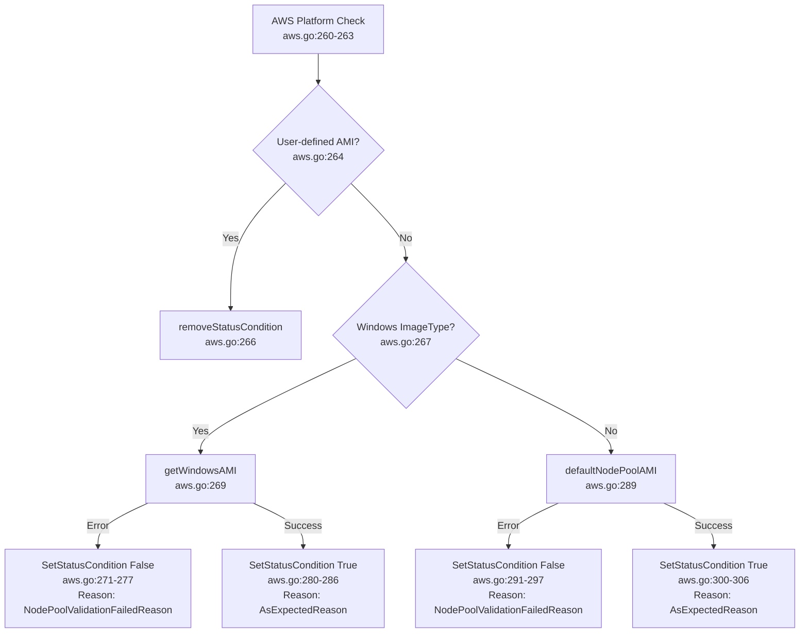
```mermaid
graph TD
    Start[AWS Platform Check<br/>aws.go:260-263] --> UserDefined{User-defined AMI?<br/>aws.go:264}

    UserDefined -->|Yes| RemoveCondition[removeStatusCondition<br/>aws.go:266]
    UserDefined -->|No| WindowsCheck{Windows ImageType?<br/>aws.go:267}

    WindowsCheck -->|Yes| GetWindowsAMI[getWindowsAMI<br/>aws.go:269]
    WindowsCheck -->|No| GetDefaultAMI[defaultNodePoolAMI<br/>aws.go:289]

    GetWindowsAMI -->|Error| SetWindowsFalse[SetStatusCondition False<br/>aws.go:271-277<br/>Reason: NodePoolValidationFailedReason]
    GetWindowsAMI -->|Success| SetWindowsTrue[SetStatusCondition True<br/>aws.go:280-286<br/>Reason: AsExpectedReason]

    GetDefaultAMI -->|Error| SetDefaultFalse[SetStatusCondition False<br/>aws.go:291-297<br/>Reason: NodePoolValidationFailedReason]
    GetDefaultAMI -->|Success| SetDefaultTrue[SetStatusCondition True<br/>aws.go:300-306<br/>Reason: AsExpectedReason]
```

### ValidPlatformImage Condition (KubeVirt)

**Code Location**: `kubevirt.go:35-115`

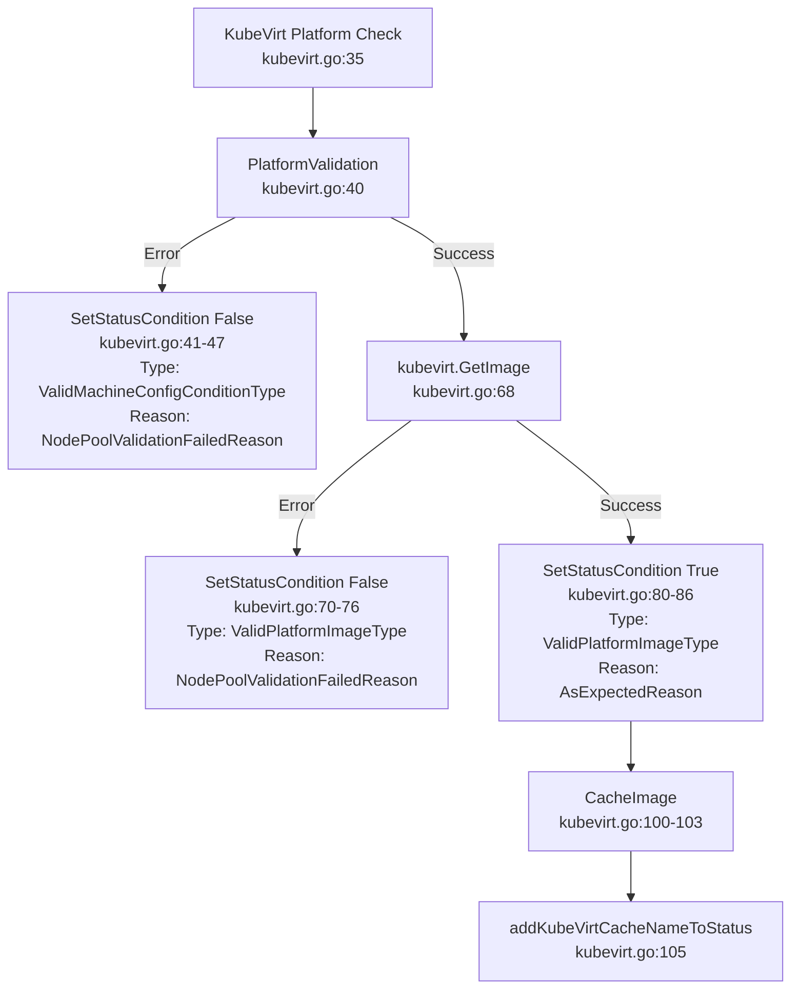
```mermaid
graph TD
    Start[KubeVirt Platform Check<br/>kubevirt.go:35] --> Validate[PlatformValidation<br/>kubevirt.go:40]

    Validate -->|Error| SetValidationFalse[SetStatusCondition False<br/>kubevirt.go:41-47<br/>Type: ValidMachineConfigConditionType<br/>Reason: NodePoolValidationFailedReason]
    Validate -->|Success| GetImage[kubevirt.GetImage<br/>kubevirt.go:68]

    GetImage -->|Error| SetImageFalse[SetStatusCondition False<br/>kubevirt.go:70-76<br/>Type: ValidPlatformImageType<br/>Reason: NodePoolValidationFailedReason]
    GetImage -->|Success| SetImageTrue[SetStatusCondition True<br/>kubevirt.go:80-86<br/>Type: ValidPlatformImageType<br/>Reason: AsExpectedReason]

    SetImageTrue --> CacheImage[CacheImage<br/>kubevirt.go:100-103]
    CacheImage --> AddCacheName[addKubeVirtCacheNameToStatus<br/>kubevirt.go:105]
```

### ValidMachineConfig Condition

**Code Location**: `conditions.go:344-382`

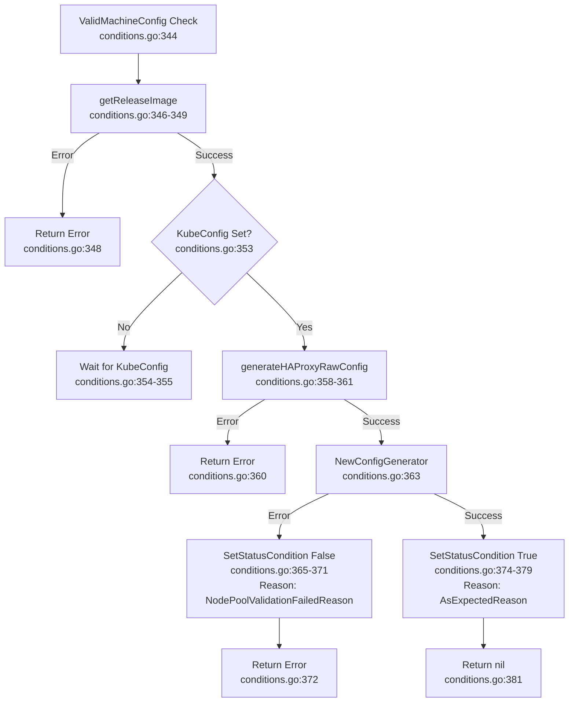
```mermaid
graph TD
    Start[ValidMachineConfig Check<br/>conditions.go:344] --> GetRelease[getReleaseImage<br/>conditions.go:346-349]

    GetRelease -->|Error| ReturnError[Return Error<br/>conditions.go:348]
    GetRelease -->|Success| CheckKubeConfig{KubeConfig Set?<br/>conditions.go:353}

    CheckKubeConfig -->|No| Wait[Wait for KubeConfig<br/>conditions.go:354-355]
    CheckKubeConfig -->|Yes| GenHAProxy[generateHAProxyRawConfig<br/>conditions.go:358-361]

    GenHAProxy -->|Error| ReturnError2[Return Error<br/>conditions.go:360]
    GenHAProxy -->|Success| NewConfigGen[NewConfigGenerator<br/>conditions.go:363]

    NewConfigGen -->|Error| SetFalse[SetStatusCondition False<br/>conditions.go:365-371<br/>Reason: NodePoolValidationFailedReason]
    NewConfigGen -->|Success| SetTrue[SetStatusCondition True<br/>conditions.go:374-379<br/>Reason: AsExpectedReason]

    SetFalse --> ReturnError3[Return Error<br/>conditions.go:372]
    SetTrue --> ReturnNil[Return nil<br/>conditions.go:381]
```

### SupportedVersionSkew Condition

**Code Location**: `conditions.go:887-974`

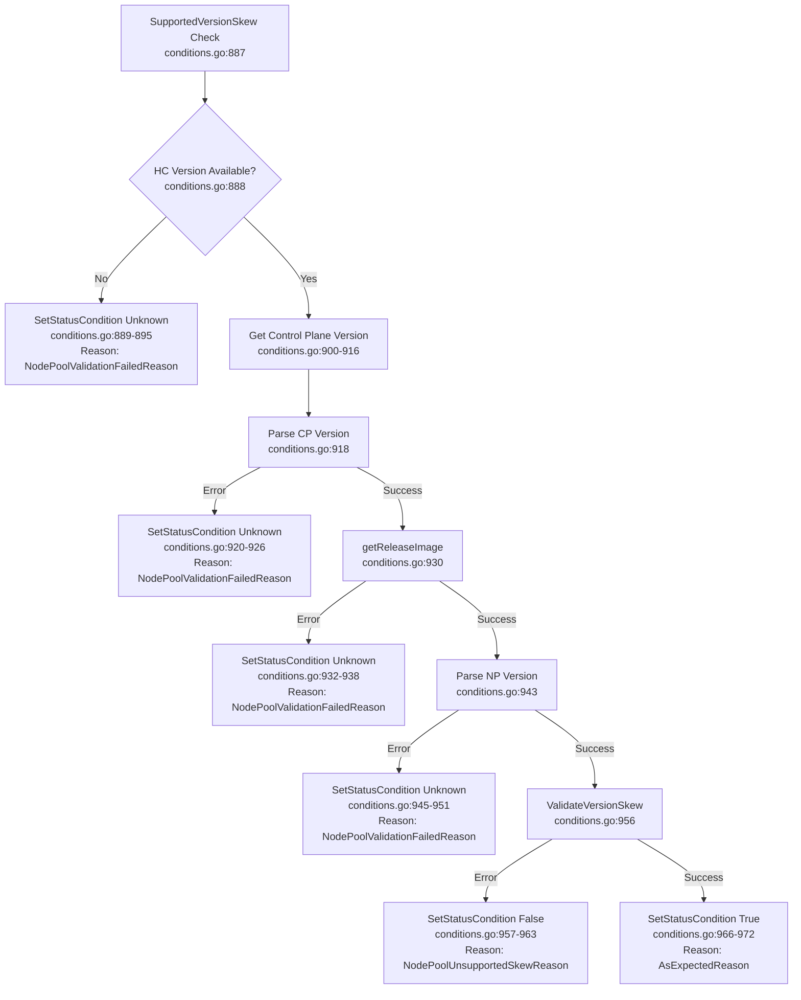
```mermaid
graph TD
    Start[SupportedVersionSkew Check<br/>conditions.go:887] --> CheckHCVersion{HC Version Available?<br/>conditions.go:888}

    CheckHCVersion -->|No| SetUnknown1[SetStatusCondition Unknown<br/>conditions.go:889-895<br/>Reason: NodePoolValidationFailedReason]
    CheckHCVersion -->|Yes| GetCPVersion[Get Control Plane Version<br/>conditions.go:900-916]

    GetCPVersion --> ParseCPVersion[Parse CP Version<br/>conditions.go:918]

    ParseCPVersion -->|Error| SetUnknown2[SetStatusCondition Unknown<br/>conditions.go:920-926<br/>Reason: NodePoolValidationFailedReason]
    ParseCPVersion -->|Success| GetNPRelease[getReleaseImage<br/>conditions.go:930]

    GetNPRelease -->|Error| SetUnknown3[SetStatusCondition Unknown<br/>conditions.go:932-938<br/>Reason: NodePoolValidationFailedReason]
    GetNPRelease -->|Success| ParseNPVersion[Parse NP Version<br/>conditions.go:943]

    ParseNPVersion -->|Error| SetUnknown4[SetStatusCondition Unknown<br/>conditions.go:945-951<br/>Reason: NodePoolValidationFailedReason]
    ParseNPVersion -->|Success| ValidateSkew[ValidateVersionSkew<br/>conditions.go:956]

    ValidateSkew -->|Error| SetFalse[SetStatusCondition False<br/>conditions.go:957-963<br/>Reason: NodePoolUnsupportedSkewReason]
    ValidateSkew -->|Success| SetTrue[SetStatusCondition True<br/>conditions.go:966-972<br/>Reason: AsExpectedReason]
```

### ValidArchPlatform Condition

**Code Location**: `conditions.go:312-342`

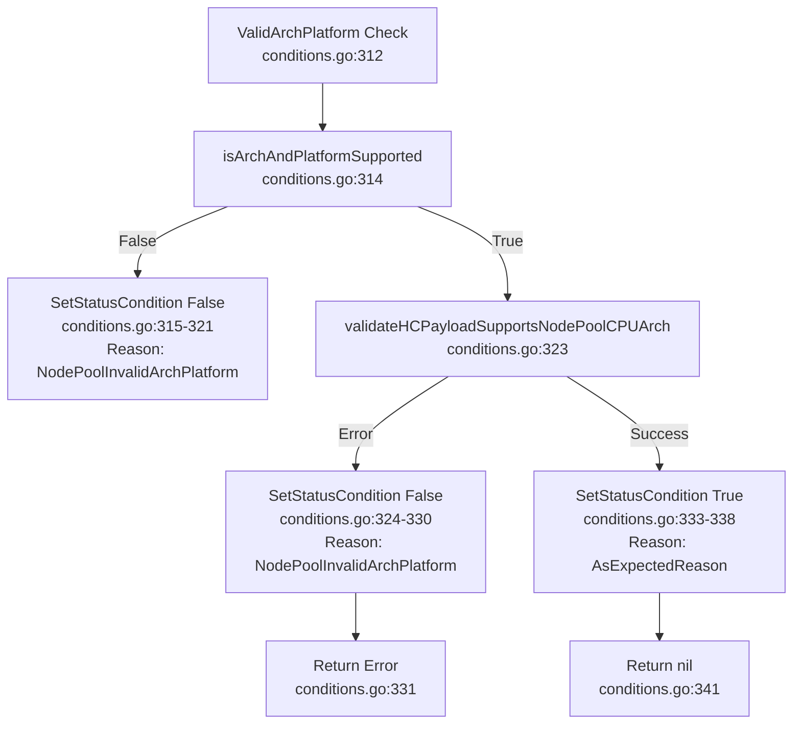
```mermaid
graph TD
    Start[ValidArchPlatform Check<br/>conditions.go:312] --> CheckArch[isArchAndPlatformSupported<br/>conditions.go:314]

    CheckArch -->|False| SetArchFalse[SetStatusCondition False<br/>conditions.go:315-321<br/>Reason: NodePoolInvalidArchPlatform]
    CheckArch -->|True| ValidatePayload[validateHCPayloadSupportsNodePoolCPUArch<br/>conditions.go:323]

    ValidatePayload -->|Error| SetPayloadFalse[SetStatusCondition False<br/>conditions.go:324-330<br/>Reason: NodePoolInvalidArchPlatform]
    ValidatePayload -->|Success| SetTrue[SetStatusCondition True<br/>conditions.go:333-338<br/>Reason: AsExpectedReason]

    SetPayloadFalse --> ReturnError[Return Error<br/>conditions.go:331]
    SetTrue --> ReturnNil[Return nil<br/>conditions.go:341]
```

### ValidPlatformConfig Condition

**Code Location**: `conditions.go:862-885`

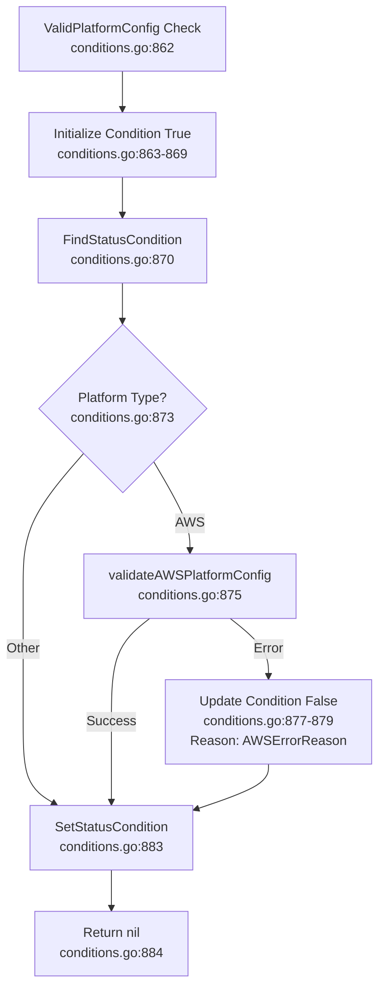
```mermaid
graph TD
    Start[ValidPlatformConfig Check<br/>conditions.go:862] --> InitCondition[Initialize Condition True<br/>conditions.go:863-869]

    InitCondition --> GetOldCondition[FindStatusCondition<br/>conditions.go:870]

    GetOldCondition --> CheckPlatform{Platform Type?<br/>conditions.go:873}

    CheckPlatform -->|AWS| ValidateAWS[validateAWSPlatformConfig<br/>conditions.go:875]
    CheckPlatform -->|Other| SetCondition[SetStatusCondition<br/>conditions.go:883]

    ValidateAWS -->|Error| UpdateFalse[Update Condition False<br/>conditions.go:877-879<br/>Reason: AWSErrorReason]
    ValidateAWS -->|Success| SetCondition

    UpdateFalse --> SetCondition
    SetCondition --> ReturnNil[Return nil<br/>conditions.go:884]
```

## Management Conditions

### AutoscalingEnabled Condition

**Code Location**: `conditions.go:164-208`

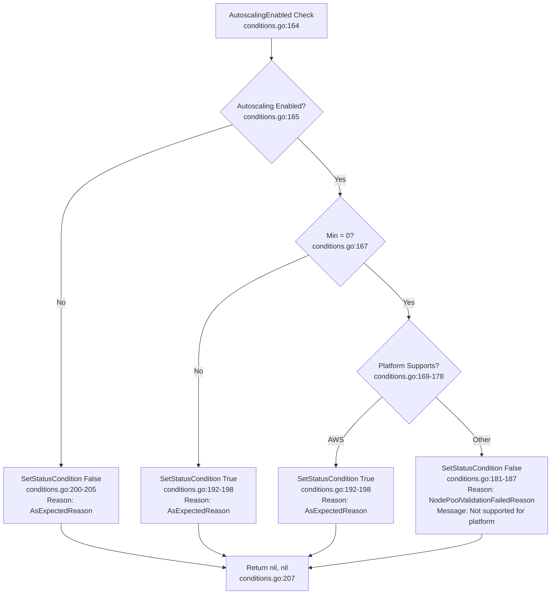
```mermaid
graph TD
    Start[AutoscalingEnabled Check<br/>conditions.go:164] --> IsEnabled{Autoscaling Enabled?<br/>conditions.go:165}

    IsEnabled -->|No| SetFalse[SetStatusCondition False<br/>conditions.go:200-205<br/>Reason: AsExpectedReason]
    IsEnabled -->|Yes| CheckMin{Min = 0?<br/>conditions.go:167}

    CheckMin -->|No| SetTrue1[SetStatusCondition True<br/>conditions.go:192-198<br/>Reason: AsExpectedReason]
    CheckMin -->|Yes| CheckPlatform{Platform Supports?<br/>conditions.go:169-178}

    CheckPlatform -->|AWS| SetTrue2[SetStatusCondition True<br/>conditions.go:192-198<br/>Reason: AsExpectedReason]
    CheckPlatform -->|Other| SetNotSupported[SetStatusCondition False<br/>conditions.go:181-187<br/>Reason: NodePoolValidationFailedReason<br/>Message: Not supported for platform]

    SetFalse --> ReturnNil[Return nil, nil<br/>conditions.go:207]
    SetTrue1 --> ReturnNil
    SetTrue2 --> ReturnNil
    SetNotSupported --> ReturnNil
```

### UpdateManagementEnabled Condition

**Code Location**: `conditions.go:210-234`

```mermaid
graph TD
    Start[UpdateManagementEnabled Check<br/>conditions.go:210] --> Validate[validateManagement<br/>conditions.go:212]

    Validate -->|Error| SetFalse[SetStatusCondition False<br/>conditions.go:213-219<br/>Reason: NodePoolValidationFailedReason]
    Validate -->|Success| SetTrue[SetStatusCondition True<br/>conditions.go:226-231<br/>Reason: AsExpectedReason]

    SetFalse --> LogError[Log Error<br/>conditions.go:222]
    LogError --> ReturnNoError[Return ctrl.Result{}, nil<br/>conditions.go:223]

    SetTrue --> ReturnNil[Return nil, nil<br/>conditions.go:233]
```

### AutorepairEnabled Condition

**Code Location**: Referenced in controller but set in CAPI reconciliation

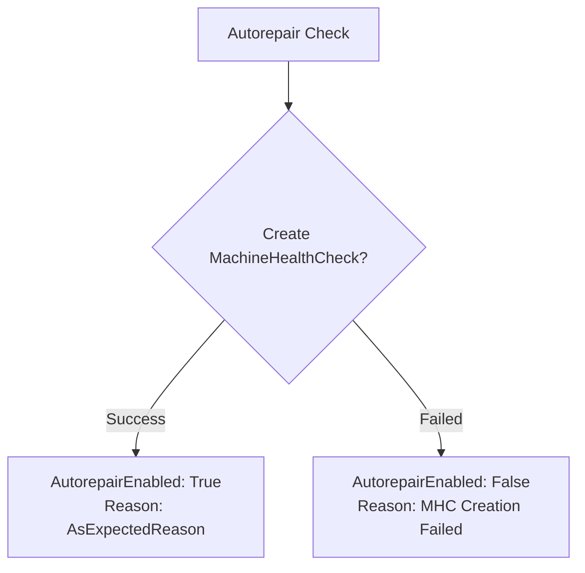
```mermaid
graph TD
    Start[Autorepair Check] --> CreateMHC{Create MachineHealthCheck?}

    CreateMHC -->|Success| SetTrue[AutorepairEnabled: True<br/>Reason: AsExpectedReason]
    CreateMHC -->|Failed| SetFalse[AutorepairEnabled: False<br/>Reason: MHC Creation Failed]
```

## Update Status Conditions

### UpdatingConfig Condition

**Code Location**: `conditions.go:384-445`

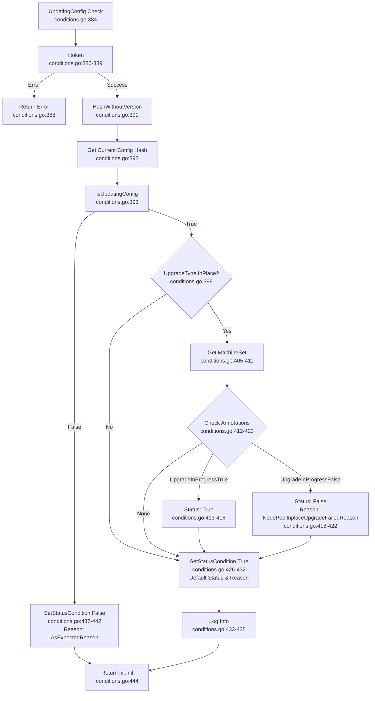
```mermaid
graph TD
    Start[UpdatingConfig Check<br/>conditions.go:384] --> GetToken[r.token<br/>conditions.go:386-389]

    GetToken -->|Error| ReturnError[Return Error<br/>conditions.go:388]
    GetToken -->|Success| CalcHash[HashWithoutVersion<br/>conditions.go:391]

    CalcHash --> GetCurrent[Get Current Config Hash<br/>conditions.go:392]
    GetCurrent --> Compare[isUpdatingConfig<br/>conditions.go:393]

    Compare -->|True| CheckUpgradeType{UpgradeType InPlace?<br/>conditions.go:399}
    Compare -->|False| SetFalse[SetStatusCondition False<br/>conditions.go:437-442<br/>Reason: AsExpectedReason]

    CheckUpgradeType -->|Yes| GetMachineSet[Get MachineSet<br/>conditions.go:405-411]
    CheckUpgradeType -->|No| SetUpdatingTrue[SetStatusCondition True<br/>conditions.go:426-432<br/>Default Status & Reason]

    GetMachineSet --> CheckAnnotations{Check Annotations<br/>conditions.go:412-423}

    CheckAnnotations -->|UpgradeInProgressTrue| UpdateTrue[Status: True<br/>conditions.go:413-416]
    CheckAnnotations -->|UpgradeInProgressFalse| UpdateFailed[Status: False<br/>Reason: NodePoolInplaceUpgradeFailedReason<br/>conditions.go:418-422]
    CheckAnnotations -->|None| SetUpdatingTrue

    UpdateTrue --> SetUpdatingTrue
    UpdateFailed --> SetUpdatingTrue

    SetUpdatingTrue --> LogInfo[Log Info<br/>conditions.go:433-435]
    SetFalse --> ReturnNil[Return nil, nil<br/>conditions.go:444]
    LogInfo --> ReturnNil
```

### UpdatingVersion Condition

**Code Location**: `conditions.go:447-512`

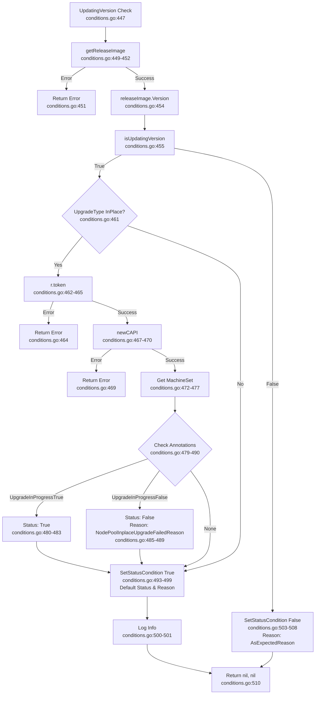
```mermaid
graph TD
    Start[UpdatingVersion Check<br/>conditions.go:447] --> GetRelease[getReleaseImage<br/>conditions.go:449-452]

    GetRelease -->|Error| ReturnError[Return Error<br/>conditions.go:451]
    GetRelease -->|Success| GetTargetVersion[releaseImage.Version<br/>conditions.go:454]

    GetTargetVersion --> Compare[isUpdatingVersion<br/>conditions.go:455]

    Compare -->|True| CheckUpgradeType{UpgradeType InPlace?<br/>conditions.go:461}
    Compare -->|False| SetFalse[SetStatusCondition False<br/>conditions.go:503-508<br/>Reason: AsExpectedReason]

    CheckUpgradeType -->|Yes| GetToken[r.token<br/>conditions.go:462-465]
    CheckUpgradeType -->|No| SetUpdatingTrue[SetStatusCondition True<br/>conditions.go:493-499<br/>Default Status & Reason]

    GetToken -->|Error| ReturnError2[Return Error<br/>conditions.go:464]
    GetToken -->|Success| GetCAPI[newCAPI<br/>conditions.go:467-470]

    GetCAPI -->|Error| ReturnError3[Return Error<br/>conditions.go:469]
    GetCAPI -->|Success| GetMachineSet[Get MachineSet<br/>conditions.go:472-477]

    GetMachineSet --> CheckAnnotations{Check Annotations<br/>conditions.go:479-490}

    CheckAnnotations -->|UpgradeInProgressTrue| UpdateTrue[Status: True<br/>conditions.go:480-483]
    CheckAnnotations -->|UpgradeInProgressFalse| UpdateFailed[Status: False<br/>Reason: NodePoolInplaceUpgradeFailedReason<br/>conditions.go:485-489]
    CheckAnnotations -->|None| SetUpdatingTrue

    UpdateTrue --> SetUpdatingTrue
    UpdateFailed --> SetUpdatingTrue

    SetUpdatingTrue --> LogInfo[Log Info<br/>conditions.go:500-501]
    SetFalse --> ReturnNil[Return nil, nil<br/>conditions.go:510]
    LogInfo --> ReturnNil
```

### UpdatingPlatformMachineTemplate Condition

**Code Location**: Set during CAPI reconciliation

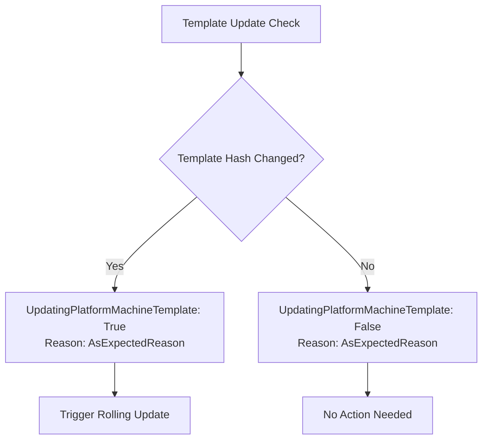
```mermaid
graph TD
    Start[Template Update Check] --> Compare{Template Hash Changed?}

    Compare -->|Yes| SetTrue[UpdatingPlatformMachineTemplate: True<br/>Reason: AsExpectedReason]
    Compare -->|No| SetFalse[UpdatingPlatformMachineTemplate: False<br/>Reason: AsExpectedReason]

    SetTrue --> RollingUpdate[Trigger Rolling Update]
    SetFalse --> NoUpdate[No Action Needed]
```

## Readiness and Health Conditions

### AllMachinesReady Condition

**Code Location**: `conditions.go:641-707`

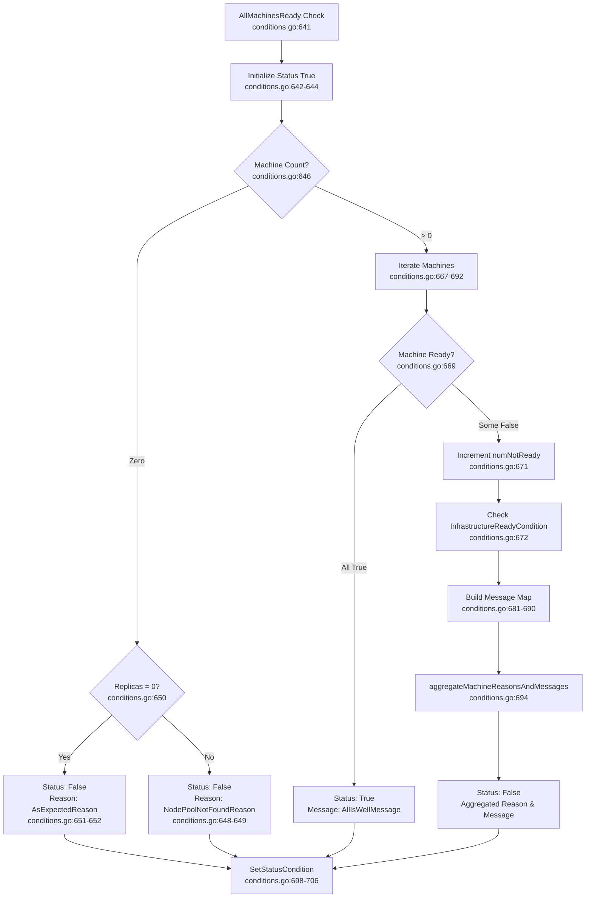
```mermaid
graph TD
    Start[AllMachinesReady Check<br/>conditions.go:641] --> InitStatus[Initialize Status True<br/>conditions.go:642-644]

    InitStatus --> CheckCount{Machine Count?<br/>conditions.go:646}

    CheckCount -->|Zero| CheckReplicas{Replicas = 0?<br/>conditions.go:650}
    CheckCount -->|> 0| IterateMachines[Iterate Machines<br/>conditions.go:667-692]

    CheckReplicas -->|Yes| SetExpected[Status: False<br/>Reason: AsExpectedReason<br/>conditions.go:651-652]
    CheckReplicas -->|No| SetNotFound[Status: False<br/>Reason: NodePoolNotFoundReason<br/>conditions.go:648-649]

    IterateMachines --> CheckReady{Machine Ready?<br/>conditions.go:669}

    CheckReady -->|All True| SetTrueStatus[Status: True<br/>Message: AllIsWellMessage]
    CheckReady -->|Some False| IncrementNotReady[Increment numNotReady<br/>conditions.go:671]

    IncrementNotReady --> CheckInfra[Check InfrastructureReadyCondition<br/>conditions.go:672]

    CheckInfra --> BuildMessage[Build Message Map<br/>conditions.go:681-690]
    BuildMessage --> Aggregate[aggregateMachineReasonsAndMessages<br/>conditions.go:694]

    Aggregate --> SetFalseStatus[Status: False<br/>Aggregated Reason & Message]

    SetExpected --> SetCondition[SetStatusCondition<br/>conditions.go:698-706]
    SetNotFound --> SetCondition
    SetTrueStatus --> SetCondition
    SetFalseStatus --> SetCondition
```

### AllNodesHealthy Condition

**Code Location**: `conditions.go:603-639`

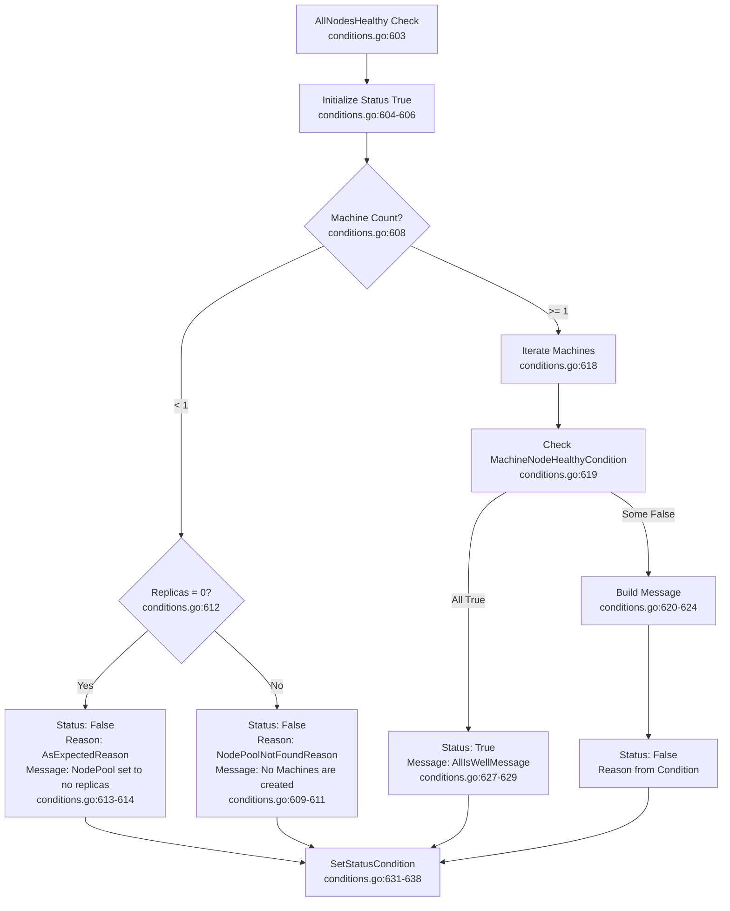
```mermaid
graph TD
    Start[AllNodesHealthy Check<br/>conditions.go:603] --> InitStatus[Initialize Status True<br/>conditions.go:604-606]

    InitStatus --> CheckCount{Machine Count?<br/>conditions.go:608}

    CheckCount -->|< 1| CheckReplicas{Replicas = 0?<br/>conditions.go:612}
    CheckCount -->|>= 1| IterateMachines[Iterate Machines<br/>conditions.go:618]

    CheckReplicas -->|Yes| SetExpected[Status: False<br/>Reason: AsExpectedReason<br/>Message: NodePool set to no replicas<br/>conditions.go:613-614]
    CheckReplicas -->|No| SetNotFound[Status: False<br/>Reason: NodePoolNotFoundReason<br/>Message: No Machines are created<br/>conditions.go:609-611]

    IterateMachines --> CheckNodeHealthy[Check MachineNodeHealthyCondition<br/>conditions.go:619]

    CheckNodeHealthy -->|All True| SetTrue[Status: True<br/>Message: AllIsWellMessage<br/>conditions.go:627-629]
    CheckNodeHealthy -->|Some False| BuildMessage[Build Message<br/>conditions.go:620-624]

    BuildMessage --> SetFalse[Status: False<br/>Reason from Condition]

    SetExpected --> SetCondition[SetStatusCondition<br/>conditions.go:631-638]
    SetNotFound --> SetCondition
    SetTrue --> SetCondition
    SetFalse --> SetCondition
```

### Ready Condition

**Code Location**: Bubbled from CAPI MachineDeployment/MachineSet

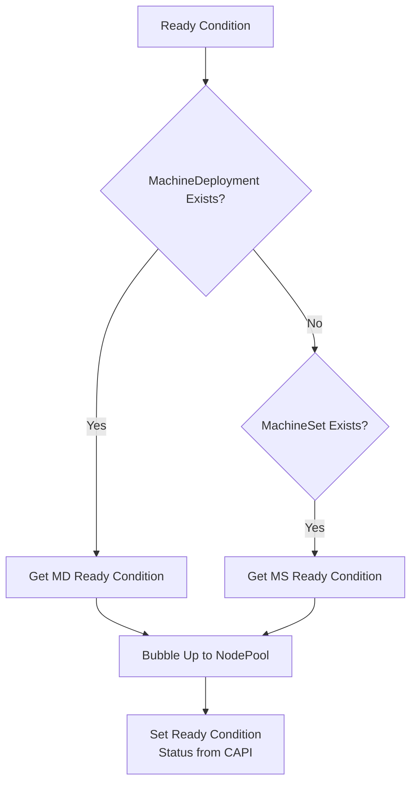
```mermaid
graph TD
    Start[Ready Condition] --> CheckMD{MachineDeployment Exists?}

    CheckMD -->|Yes| GetMDReady[Get MD Ready Condition]
    CheckMD -->|No| CheckMS{MachineSet Exists?}

    CheckMS -->|Yes| GetMSReady[Get MS Ready Condition]

    GetMDReady --> BubbleUp[Bubble Up to NodePool]
    GetMSReady --> BubbleUp

    BubbleUp --> SetReady[Set Ready Condition<br/>Status from CAPI]
```

## Reconciliation and Lifecycle Conditions

### ReconciliationActive Condition

**Code Location**: `conditions.go:563-567` and `conditions.go:115-145`

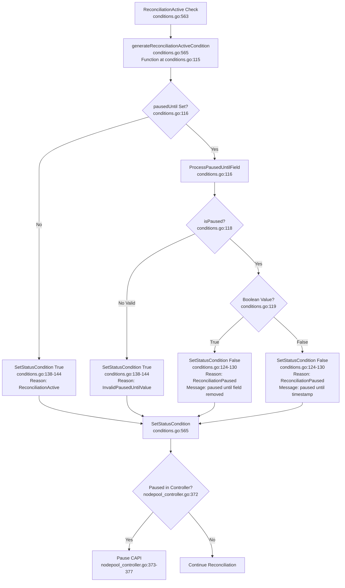
```mermaid
graph TD
    Start[ReconciliationActive Check<br/>conditions.go:563] --> Generate[generateReconciliationActiveCondition<br/>conditions.go:565<br/>Function at conditions.go:115]

    Generate --> CheckPaused{pausedUntil Set?<br/>conditions.go:116}

    CheckPaused -->|No| SetTrue[SetStatusCondition True<br/>conditions.go:138-144<br/>Reason: ReconciliationActive]
    CheckPaused -->|Yes| ParseValue[ProcessPausedUntilField<br/>conditions.go:116]

    ParseValue --> IsPaused{isPaused?<br/>conditions.go:118}

    IsPaused -->|Yes| CheckBool{Boolean Value?<br/>conditions.go:119}
    IsPaused -->|No Valid| SetInvalid[SetStatusCondition True<br/>conditions.go:138-144<br/>Reason: InvalidPausedUntilValue]

    CheckBool -->|True| SetPausedForever[SetStatusCondition False<br/>conditions.go:124-130<br/>Reason: ReconciliationPaused<br/>Message: paused until field removed]
    CheckBool -->|False| SetPausedUntil[SetStatusCondition False<br/>conditions.go:124-130<br/>Reason: ReconciliationPaused<br/>Message: paused until timestamp]

    SetTrue --> ApplyCondition[SetStatusCondition<br/>conditions.go:565]
    SetInvalid --> ApplyCondition
    SetPausedForever --> ApplyCondition
    SetPausedUntil --> ApplyCondition

    ApplyCondition --> CheckPausedInController{Paused in Controller?<br/>nodepool_controller.go:372}

    CheckPausedInController -->|Yes| PauseCAPI[Pause CAPI<br/>nodepool_controller.go:373-377]
    CheckPausedInController -->|No| ContinueReconciliation[Continue Reconciliation]
```

### ReachedIgnitionEndpoint Condition

**Code Location**: `conditions.go:529-551` and `conditions.go:765-809`

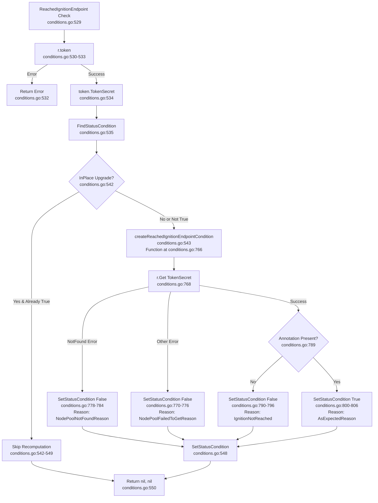
```mermaid
graph TD
    Start[ReachedIgnitionEndpoint Check<br/>conditions.go:529] --> GetToken[r.token<br/>conditions.go:530-533]

    GetToken -->|Error| ReturnError[Return Error<br/>conditions.go:532]
    GetToken -->|Success| GetTokenSecret[token.TokenSecret<br/>conditions.go:534]

    GetTokenSecret --> GetOldCondition[FindStatusCondition<br/>conditions.go:535]

    GetOldCondition --> CheckInPlace{InPlace Upgrade?<br/>conditions.go:542}

    CheckInPlace -->|Yes & Already True| Skip[Skip Recomputation<br/>conditions.go:542-549]
    CheckInPlace -->|No or Not True| CreateCondition[createReachedIgnitionEndpointCondition<br/>conditions.go:543<br/>Function at conditions.go:766]

    CreateCondition --> GetSecret[r.Get TokenSecret<br/>conditions.go:768]

    GetSecret -->|NotFound Error| SetNotFound[SetStatusCondition False<br/>conditions.go:778-784<br/>Reason: NodePoolNotFoundReason]
    GetSecret -->|Other Error| SetFailedToGet[SetStatusCondition False<br/>conditions.go:770-776<br/>Reason: NodePoolFailedToGetReason]
    GetSecret -->|Success| CheckAnnotation{Annotation Present?<br/>conditions.go:789}

    CheckAnnotation -->|No| SetNotReached[SetStatusCondition False<br/>conditions.go:790-796<br/>Reason: IgnitionNotReached]
    CheckAnnotation -->|Yes| SetReached[SetStatusCondition True<br/>conditions.go:800-806<br/>Reason: AsExpectedReason]

    SetNotFound --> ApplyCondition[SetStatusCondition<br/>conditions.go:548]
    SetFailedToGet --> ApplyCondition
    SetNotReached --> ApplyCondition
    SetReached --> ApplyCondition
    Skip --> ReturnNil[Return nil, nil<br/>conditions.go:550]
    ApplyCondition --> ReturnNil
```

### ValidGeneratedPayload Condition

**Code Location**: `conditions.go:514-527` and `conditions.go:811-859`

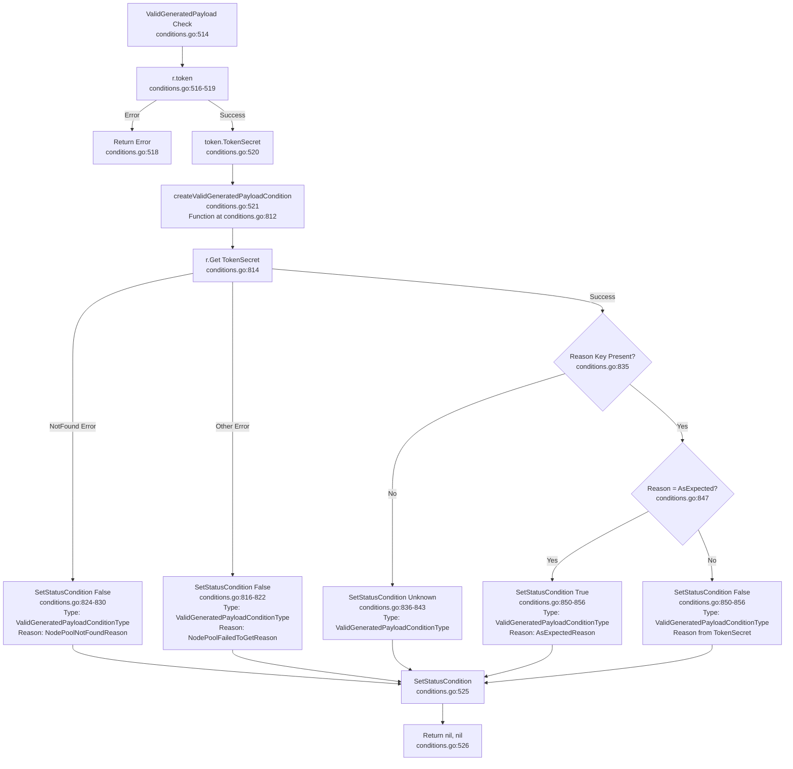
```mermaid
graph TD
    Start[ValidGeneratedPayload Check<br/>conditions.go:514] --> GetToken[r.token<br/>conditions.go:516-519]

    GetToken -->|Error| ReturnError[Return Error<br/>conditions.go:518]
    GetToken -->|Success| GetTokenSecret[token.TokenSecret<br/>conditions.go:520]

    GetTokenSecret --> CreateCondition[createValidGeneratedPayloadCondition<br/>conditions.go:521<br/>Function at conditions.go:812]

    CreateCondition --> GetSecret[r.Get TokenSecret<br/>conditions.go:814]

    GetSecret -->|NotFound Error| SetNotFound[SetStatusCondition False<br/>conditions.go:824-830<br/>Type: ValidGeneratedPayloadConditionType<br/>Reason: NodePoolNotFoundReason]
    GetSecret -->|Other Error| SetFailedToGet[SetStatusCondition False<br/>conditions.go:816-822<br/>Type: ValidGeneratedPayloadConditionType<br/>Reason: NodePoolFailedToGetReason]
    GetSecret -->|Success| CheckReasonKey{Reason Key Present?<br/>conditions.go:835}

    CheckReasonKey -->|No| SetUnknown[SetStatusCondition Unknown<br/>conditions.go:836-843<br/>Type: ValidGeneratedPayloadConditionType]
    CheckReasonKey -->|Yes| CheckReason{Reason = AsExpected?<br/>conditions.go:847}

    CheckReason -->|Yes| SetTrue[SetStatusCondition True<br/>conditions.go:850-856<br/>Type: ValidGeneratedPayloadConditionType<br/>Reason: AsExpectedReason]
    CheckReason -->|No| SetFalse[SetStatusCondition False<br/>conditions.go:850-856<br/>Type: ValidGeneratedPayloadConditionType<br/>Reason from TokenSecret]

    SetNotFound --> ApplyCondition[SetStatusCondition<br/>conditions.go:525]
    SetFailedToGet --> ApplyCondition
    SetUnknown --> ApplyCondition
    SetTrue --> ApplyCondition
    SetFalse --> ApplyCondition

    ApplyCondition --> ReturnNil[Return nil, nil<br/>conditions.go:526]
```

### IgnitionEndpointAvailable Condition

**Code Location**: `conditions.go:259-310`

```mermaid
graph TD
    Start[IgnitionEndpointAvailable Check<br/>conditions.go:259] --> GetNamespace[Get Control Plane Namespace<br/>conditions.go:262]

    GetNamespace --> CheckEndpoint{HC IgnitionEndpoint Set?<br/>conditions.go:264}

    CheckEndpoint -->|No| SetEndpointMissing[SetStatusCondition False<br/>conditions.go:265-271<br/>Type: IgnitionEndpointAvailable<br/>Reason: IgnitionEndpointMissingReason]
    CheckEndpoint -->|Yes| RemoveCondition1[removeStatusCondition<br/>conditions.go:275]

    SetEndpointMissing --> ReturnWait[Return ctrl.Result{}, nil<br/>conditions.go:273]

    RemoveCondition1 --> GetCASecret[Get IgnitionCACertSecret<br/>conditions.go:277-278]

    GetCASecret -->|NotFound| SetCACertMissing[SetStatusCondition False<br/>conditions.go:280-286<br/>Type: IgnitionEndpointAvailable<br/>Reason: IgnitionCACertMissingReason]
    GetCASecret -->|Other Error| ReturnError[Return Error<br/>conditions.go:290]
    GetCASecret -->|Success| RemoveCondition2[removeStatusCondition<br/>conditions.go:293]

    SetCACertMissing --> ReturnWait2[Return ctrl.Result{}, nil<br/>conditions.go:288]

    RemoveCondition2 --> CheckCertKey{tls.crt Key Present?<br/>conditions.go:295-296}

    CheckCertKey -->|No| SetCertKeyMissing[SetStatusCondition False<br/>conditions.go:297-303<br/>Type: IgnitionEndpointAvailable<br/>Reason: IgnitionCACertMissingReason<br/>Message: CA Secret missing tls.crt]
    CheckCertKey -->|Yes| RemoveCondition3[removeStatusCondition<br/>conditions.go:308]

    SetCertKeyMissing --> ReturnWait3[Return ctrl.Result{}, nil<br/>conditions.go:305]
    RemoveCondition3 --> ReturnNil[Return nil, nil<br/>conditions.go:309]
```

## Platform-Specific Conditions

### AWS Security Group Condition

**Code Location**: Validated in `aws.go` via `validateAWSPlatformConfig`

```mermaid
graph TD
    Start[AWS Platform Config Validation] --> CheckCPO{CPO Creates SG?}

    CheckCPO -->|Yes| CheckStatus{HC Status SG Available?<br/>aws.go:105-107}
    CheckCPO -->|No| ValidateUserSG[Validate User Security Groups]

    CheckStatus -->|No| SetNotReady[Return NotReadyError<br/>aws.go:106]
    CheckStatus -->|Yes| ContinueValidation[Continue with other validations]

    ValidateUserSG --> SetValid[Security Groups Valid]
    SetNotReady --> PropagateError[Propagate to ValidPlatformConfig]
```

### KubeVirt Live Migratable Condition

**Code Location**: `kubevirt.go:117-165`

```mermaid
graph TD
    Start[KubeVirt Live Migratable Check<br/>kubevirt.go:117] --> GetNamespace[Get Control Plane Namespace<br/>kubevirt.go:118]

    GetNamespace --> ListMachines[List KubevirtMachines<br/>kubevirt.go:119-125]

    ListMachines -->|Error| ReturnError[Return Error<br/>kubevirt.go:124]
    ListMachines -->|Success| CheckCount{Machine Count?<br/>kubevirt.go:127}

    CheckCount -->|Zero| ReturnNil[Return nil<br/>kubevirt.go:129]
    CheckCount -->|> 0| InitCounters[Initialize Counters<br/>kubevirt.go:132-134]

    InitCounters --> IterateMachines[Iterate Machines<br/>kubevirt.go:135]

    IterateMachines --> CheckConditions[Check VMLiveMigratableCondition<br/>kubevirt.go:136-143]

    CheckConditions --> CountNotMigratable{Count Not Migratable<br/>kubevirt.go:137-142}

    CountNotMigratable --> AllMigratable{All Migratable?<br/>kubevirt.go:146}

    AllMigratable -->|Yes| SetTrue[SetStatusCondition True<br/>kubevirt.go:147-153<br/>Type: NodePoolKubeVirtLiveMigratableType<br/>Reason: AsExpectedReason]
    AllMigratable -->|No| Aggregate[aggregateMachineReasonsAndMessages<br/>kubevirt.go:155]

    Aggregate --> SetFalse[SetStatusCondition False<br/>kubevirt.go:156-162<br/>Type: NodePoolKubeVirtLiveMigratableType<br/>Aggregated Reason]

    SetTrue --> ReturnNil2[Return nil<br/>kubevirt.go:164]
    SetFalse --> ReturnNil2
```

### Cluster Network CIDR Conflict Condition

**Code Location**: `conditions.go:709-763`

```mermaid
graph TD
    Start[CIDR Conflict Check<br/>conditions.go:709] --> CheckPrereqs{Machines & ClusterNetwork?<br/>conditions.go:712}

    CheckPrereqs -->|No| RemoveCondition[removeStatusCondition<br/>conditions.go:713]
    CheckPrereqs -->|Yes| ParseCIDR[Parse Cluster Network CIDR<br/>conditions.go:717-721]

    RemoveCondition --> ReturnNil[Return nil<br/>conditions.go:714]

    ParseCIDR -->|Error| ReturnError[Return Error<br/>conditions.go:720]
    ParseCIDR -->|Success| InitMessages[Initialize Messages<br/>conditions.go:723]

    InitMessages --> IterateMachines[Iterate Machines<br/>conditions.go:724]

    IterateMachines --> CheckAddresses[Check Machine Addresses<br/>conditions.go:725-737]

    CheckAddresses --> ParseIP[Parse IP Address<br/>conditions.go:729-732]

    ParseIP --> CheckContains{CIDR Contains IP?<br/>conditions.go:733}

    CheckContains -->|Yes| AddMessage[Add to Messages<br/>conditions.go:734]
    CheckContains -->|No| Continue[Continue]

    AddMessage --> Continue
    Continue --> CheckMessages{Messages Present?<br/>conditions.go:739}

    CheckMessages -->|No| ReturnNil2[Return nil<br/>conditions.go:762]
    CheckMessages -->|Yes| BuildMessage[Build Aggregated Message<br/>conditions.go:740-750]

    BuildMessage --> SetTrue[SetStatusCondition True<br/>conditions.go:752-759<br/>Type: ClusterNetworkCIDRConflictType<br/>Reason: InvalidConfigurationReason]

    SetTrue --> ReturnNil2
```

## Complete Condition Reference

### All Conditions with Code Locations

| Condition Type | Code Location | Set Function | Line Numbers |
|----------------|---------------|--------------|--------------|
| **Validation Conditions** |
| `ValidReleaseImage` | `conditions.go` | `releaseImageCondition` | 236-257 |
| `ValidPlatformImage` (AWS) | `aws.go` | `setAWSConditions` | 259-306 |
| `ValidPlatformImage` (KubeVirt) | `kubevirt.go` | `setKubevirtConditions` | 68-86 |
| `ValidMachineConfig` | `conditions.go` | `validMachineConfigCondition` | 344-382 |
| `ValidTuningConfig` | Generated during config generation | - | - |
| `ValidPlatformConfig` | `conditions.go` | `validPlatformConfigCondition` | 862-885 |
| `SupportedVersionSkew` | `conditions.go` | `supportedVersionSkewCondition` | 887-974 |
| `ValidArchPlatform` | `conditions.go` | `validArchPlatformCondition` | 312-342 |
| **Management Conditions** |
| `AutoscalingEnabled` | `conditions.go` | `autoscalerEnabledCondition` | 164-208 |
| `UpdateManagementEnabled` | `conditions.go` | `updateManagementEnabledCondition` | 210-234 |
| `AutorepairEnabled` | CAPI reconciliation | - | - |
| **Update Status Conditions** |
| `UpdatingVersion` | `conditions.go` | `updatingVersionCondition` | 447-512 |
| `UpdatingConfig` | `conditions.go` | `updatingConfigCondition` | 384-445 |
| `UpdatingPlatformMachineTemplate` | CAPI reconciliation | - | - |
| **Readiness Conditions** |
| `AllMachinesReady` | `conditions.go` | `setAllMachinesReadyCondition` | 641-707 |
| `AllNodesHealthy` | `conditions.go` | `setAllNodesHealthyCondition` | 603-639 |
| `Ready` | Bubbled from CAPI | - | - |
| **Lifecycle Conditions** |
| `ReconciliationActive` | `conditions.go` | `reconciliationActiveCondition` | 563-567, 115-145 |
| `ReachedIgnitionEndpoint` | `conditions.go` | `reachedIgnitionEndpointCondition` | 529-551, 765-809 |
| `ValidGeneratedPayload` | `conditions.go` | `validGeneratedPayloadCondition` | 514-527, 811-859 |
| `IgnitionEndpointAvailable` | `conditions.go` | `ignitionEndpointAvailableCondition` | 259-310 |
| **Platform-Specific Conditions** |
| `AWSSecurityGroupAvailable` | `aws.go` | Part of `validateAWSPlatformConfig` | Referenced in validation |
| `ValidMachineTemplate` (KubeVirt) | `kubevirt.go` | `kubevirtMachineTemplate` | 167-197 |
| `ClusterNetworkCIDRConflict` | `conditions.go` | `setCIDRConflictCondition` | 709-763 |
| `KubeVirtNodesLiveMigratable` | `kubevirt.go` | `setAllMachinesLMCondition` | 117-165 |

### Helper Functions

| Function | Location | Purpose | Line Numbers |
|----------|----------|---------|--------------|
| `SetStatusCondition` | `conditions.go` | Sets or updates a condition | 46-71 |
| `removeStatusCondition` | `conditions.go` | Removes a condition | 73-88 |
| `FindStatusCondition` | `conditions.go` | Finds a condition by type | 90-99 |
| `findCAPIStatusCondition` | `conditions.go` | Finds CAPI condition | 101-110 |
| `generateReconciliationActiveCondition` | `conditions.go` | Generates reconciliation condition | 115-145 |
| `aggregateMachineReasonsAndMessages` | `nodepool_controller.go` | Aggregates machine messages | 1045-1066 |
| `isUpdatingVersion` | `nodepool_controller.go` | Checks if version is updating | 685-687 |
| `isUpdatingConfig` | `nodepool_controller.go` | Checks if config is updating | 689-691 |
| `isUpdatingMachineTemplate` | `nodepool_controller.go` | Checks if template is updating | 693-695 |
| `isAutoscalingEnabled` | `nodepool_controller.go` | Checks if autoscaling is enabled | 697-699 |

### Condition Flow Order

The conditions are checked in this specific order in `nodepool_controller.go:278-298`:

1. `AutoscalingEnabled` (line 279)
2. `UpdateManagementEnabled` (line 280)
3. `ValidReleaseImage` (line 281)
4. `IgnitionEndpointAvailable` (line 282)
5. `ValidArchPlatform` (line 283)
6. `ReconciliationActive` (line 284)
7. `SupportedVersionSkew` (line 286)
8. `ValidMachineConfig` (line 287)
9. `UpdatingConfig` (line 288)
10. `UpdatingVersion` (line 289)
11. `ValidGeneratedPayload` (line 291)
12. `ReachedIgnitionEndpoint` (line 292)
13. `AllMachinesReady` (line 293)
14. `ValidPlatformConfig` (line 294)

After the condition loop, platform-specific conditions are set (line 333-335).

## References

- **Main Controller**: `hypershift-operator/controllers/nodepool/nodepool_controller.go`
- **Conditions Logic**: `hypershift-operator/controllers/nodepool/conditions.go`
- **AWS Platform**: `hypershift-operator/controllers/nodepool/aws.go`
- **KubeVirt Platform**: `hypershift-operator/controllers/nodepool/kubevirt.go`
- **API Types**: `api/hypershift/v1beta1/nodepool_types.go`
